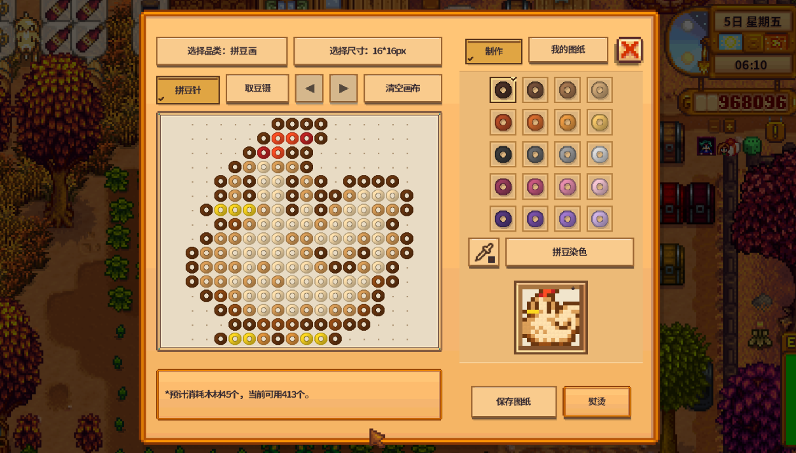

# Better Beads / 更好的拼豆

[Nexus Mods](https://www.nexusmods.com/stardewvalley/mods/53029) · [Downloads](https://github.com/huxinzhao/BetterBeads/releases)

把任意图案做成挂画、摆件、壁纸、地板和武器。自由摆豆、调色、导入图片或分享图纸；作品可出售，挂画可赠送给村民。

Turn your own designs into bead wall art, ornaments, wallpaper, flooring and weapons. Draw, recolor, import images and share designs; sell your work or gift paintings to villagers.
Better Beads / 更好的拼豆 · 1.1.0 RC4 更新内容

- 新增拼豆壁纸与地板，用一小块图案重复装修房间；
- 拼豆染色可搜索 MARD 221 色号；新增整幅或框选图案的移动、复制。
- 未保存草稿可在下次打开时恢复，制作仍不强制保存图纸。
- 新制武器按形状、长度与重量决定伤害和手感。旧武器属性不变。
- 增加手柄逐格操作，统一新增窗口风格，修复吸管、焦点和弹窗误触等问题。
- 改善联机交易、装修失败回滚与资源缓存，并加入 Nexus 更新提示。

需要星露谷1.6、SMAPI 4.5.1或更新兼容版本；支持中文、英文。
更新前退出游戏，备份自定义配置、素材及 imports、exports、draft-recovery 文件夹，替换 BetterBeads 文件夹，不同时安装旧版。
联机玩家须使用同一候选包。

欢迎反馈 Bug；喜欢的话，也请点个 Endorse 支持一下！
https://www.nexusmods.com/stardewvalley/mods/53029

---

Better Beads · 1.1.0 RC4 Update

- Make repeating bead wallpaper and flooring from a small pattern.
- Search MARD 221 color codes. Move or copy a whole pattern or a selected area.
- Recover unsaved drafts when you reopen the workbench. Crafting still does not force a design save.
- New weapons use shape, length and weight for damage and handling. Existing weapons keep their stats.
- Added bead-by-bead controller input, consistent new windows, and fixes for eyedropper, focus and accidental input.
- Improved co-op transactions, decorating rollback and resource caching; added Nexus update notifications.

Requires Stardew Valley 1.6 and SMAPI 4.5.1 or a newer compatible version. English and Chinese included.
Exit the game before updating. Back up custom config, assets, imports, exports and draft-recovery, then replace the BetterBeads folder. Install only one copy.
Every co-op player needs the same candidate package.

Bug reports are welcome! If you enjoy the mod, please leave an endorsement.
https://www.nexusmods.com/stardewvalley/mods/53029

## Install and controls / 安装与操作

Place the BetterBeads folder in Mods. Reach Foraging 2, read Robin's letter, then buy the workbench recipe from her. Left-click draws, right-click erases; wheel zooms, middle drag or Space + left drag pans. Ctrl+S saves, Ctrl+Z/Y undo/redo, Home fits the board. Generic Mod Config Menu is optional.

将 BetterBeads 文件夹放入 Mods。觅食2级后阅读罗宾来信，向她购买拼豆台配方。左键摆豆、右键擦除、滚轮缩放、中键或空格＋左键平移；Ctrl+S保存，Ctrl+Z/Y撤销重做，Home适应画布。GMCM可选。

See [build instructions](BUILD.md), [candidate checks](docs/RC4_SOURCE_REVIEW.md), and [offline UI previews](art/player-experience-1.1.0-RC4/index.html).
Edit text in BetterBeads/i18n, or use the text/pixel editors in art. Android loading has not been verified; this desktop candidate is not labeled Android compatible.

Project code: © 2026 xinzh, all rights reserved. Public source availability is not permission to redistribute modified versions. See [LICENSE.txt](LICENSE.txt) and [third-party notices](THIRD_PARTY_NOTICES.md).
